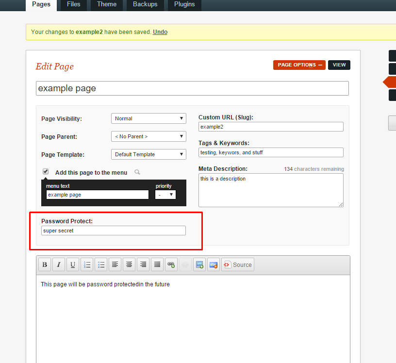
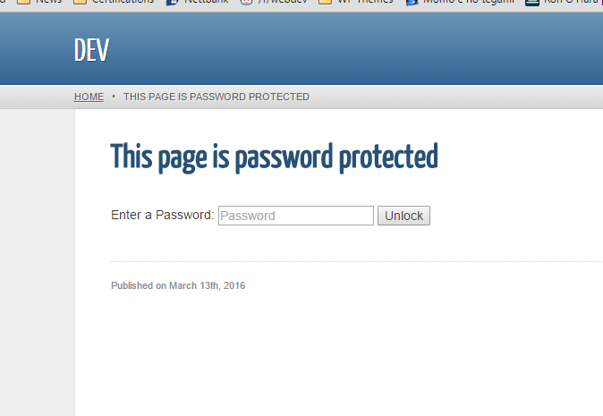

# Password Protect
A Plugin for GetSimple CMS that let's you password protect pages

### About Password Protect

Password Protect let's GetSimple CMS users assign a password to their pages, a user can enter a password to gain access to the page.

A very simple plugin to use and is ideal for webmasters that need a quick and simple way to password restrict a page.


## Screenshots






## Install the plugin

[Download here](http://example.com)

```
1. Download the plugin zip file.
2. Unzip it into /plugins
3. Activate it in the "Plugins" tab in your GetSimple CMS admin area.
4. Done
```


### Features

- Add password to a page


### Reporting bugs

Please report bugs in the support thread [here](http://get-simple.info/forums/showthread.php?tid=8144) or 
create a [GitHub Issue](https://github.com/HelgeSverre/referrer-blocker/issues).